<div align="center">



[](https://git.io/typing-svg)

[](https://0xRoshiSh3ll.com)
[](https://fisi-quest.de)


</div>

---

```yaml
> whoami
alias : 0xRoshiSh3ll
role  : Fachinformatiker Systemintegration
focus : Netzwerke / Firewalls / Virtualisierung
build : FISI Quest
motto : ship additive, break nothing
```

## Projekte

**[FISI Quest](https://fisi-quest.de)** - Gamified 8-bit Lernplattform fuer IHK-Pruefungen (AP1, AP2, WISO).
`24 Lektionen` · `374 Fragen` · `Subnet-Trainer` · `SQL-Terminal` · `Pruefungssimulationen`
Stack: `JS` · `Firebase` · `Firestore` · `Netlify`

**[0xRoshiSh3ll.com](https://0xRoshiSh3ll.com)** - Hacker-Identity & persoenliche Seite.

## Stack

<div align="center">


</div>

---

```
   .--.     Kernel panic -
  |o_o |    too much to learn.
  |:_/ |    Reboot into:
 //   \ \   FISI Quest.
(|     | )
/'\_   _/`\
\___)=(___/
```

<div align="center">


`> exit 0`

</div>
